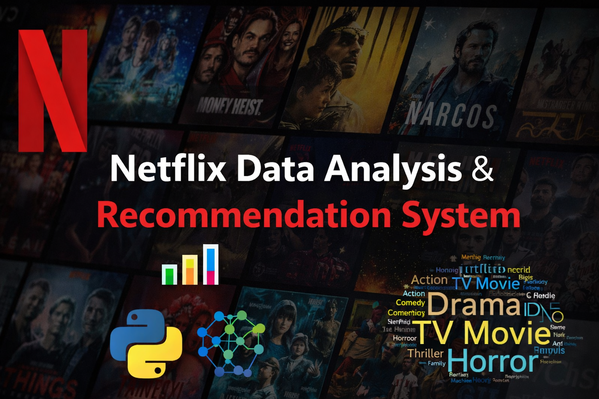
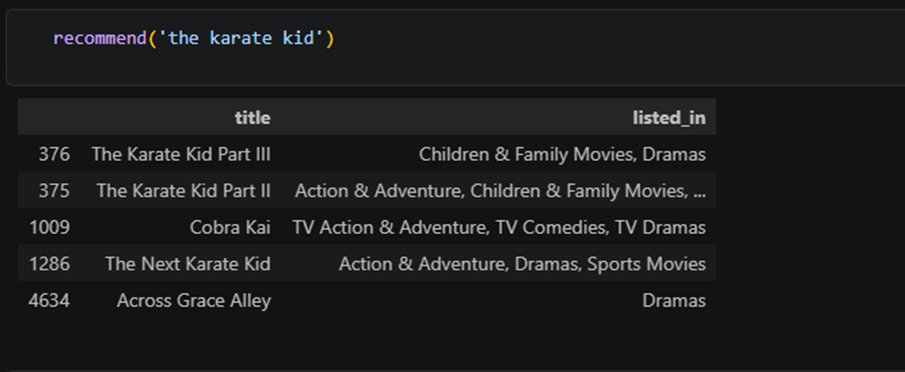
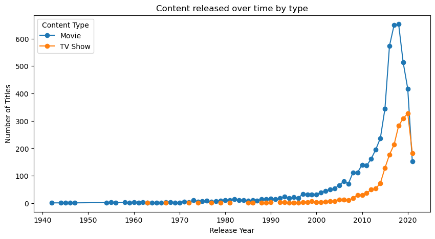
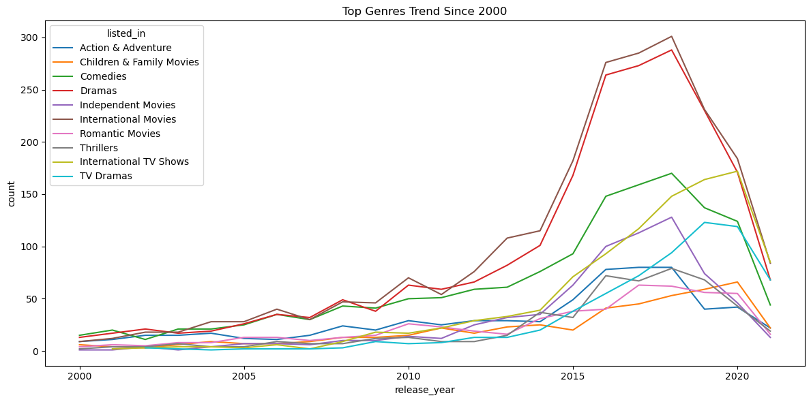

# Netflix Data Analysis & Recommendation System 📊🎬

## 📌 Project Summary

This project performs an exploratory data analysis (EDA) on Netflix content to uncover patterns in content type, genres, ratings, duration, and growth trends over time.
Additionally, a **content-based recommendation system** is built to suggest similar titles based on textual and categorical features.

---

## 📌 Project Objective

* Analyze Netflix dataset to identify content trends
* Compare Movies vs TV Shows across multiple dimensions
* Understand genre popularity, ratings, and duration patterns
* Study time-based trends in content addition
* Build a recommendation system to suggest similar content

---

## 🛠 Tools & Technologies

* Python
* Pandas
* Matplotlib
* Seaborn
* Scikit-learn (TF-IDF, Cosine Similarity)

---

## 📂 Project Structure

* `notebooks/` → Complete EDA + Recommendation System
* `requirements.txt` → Dependencies

---

## 📊 Dataset Column Dictionary

| Column Name     | Description |
|----------------|------------|
| show_id        | Unique ID for each title |
| type           | Movie or TV Show |
| title          | Name of the content |
| director       | Director of the content |
| cast           | Actors/Actresses |
| country        | Country of production |
| date_added     | Date added to Netflix |
| release_year   | Year of release |
| rating         | Content rating (e.g., TV-MA, PG) |
| duration       | Duration (minutes or seasons) |
| listed_in      | Genre/category |
| description    | Short summary of content |

---

## 📊 Dataset Preview

<table border="1" class="dataframe">
  <thead>
    <tr style="text-align: right;">
      <th></th>
      <th>show_id</th>
      <th>type</th>
      <th>title</th>
      <th>director</th>
      <th>cast</th>
      <th>country</th>
      <th>date_added</th>
      <th>release_year</th>
      <th>rating</th>
      <th>duration</th>
      <th>listed_in</th>
      <th>description</th>
    </tr>
  </thead>
  <tbody>
    <tr>
      <th>0</th>
      <td>s1</td>
      <td>Movie</td>
      <td>Dick Johnson Is Dead</td>
      <td>Kirsten Johnson</td>
      <td>NaN</td>
      <td>United States</td>
      <td>September 25, 2021</td>
      <td>2020</td>
      <td>PG-13</td>
      <td>90 min</td>
      <td>Documentaries</td>
      <td>As her father nears the end of his life, filmm...</td>
    </tr>
    <tr>
      <th>1</th>
      <td>s2</td>
      <td>TV Show</td>
      <td>Blood &amp; Water</td>
      <td>NaN</td>
      <td>Ama Qamata, Khosi Ngema, Gail Mabalane, Thaban...</td>
      <td>South Africa</td>
      <td>September 24, 2021</td>
      <td>2021</td>
      <td>TV-MA</td>
      <td>2 Seasons</td>
      <td>International TV Shows, TV Dramas, TV Mysteries</td>
      <td>After crossing paths at a party, a Cape Town t...</td>
    </tr>
    <tr>
      <th>2</th>
      <td>s3</td>
      <td>TV Show</td>
      <td>Ganglands</td>
      <td>Julien Leclercq</td>
      <td>Sami Bouajila, Tracy Gotoas, Samuel Jouy, Nabi...</td>
      <td>NaN</td>
      <td>September 24, 2021</td>
      <td>2021</td>
      <td>TV-MA</td>
      <td>1 Season</td>
      <td>Crime TV Shows, International TV Shows, TV Act...</td>
      <td>To protect his family from a powerful drug lor...</td>
    </tr>
  </tbody>
</table>

---

## 🔍 Analysis Performed

### 1. Data Preparation

* Handling Missing Values
* Feature Engineering

---

### 2. Exploratory Data Analysis (EDA)

#### 🔹 Univariate Analysis

* Content distribution: Movies vs TV Shows
* Top 10 directors
* Top cast (actors & actresses)
* Top content-producing countries
* Release trends over time
* Rating distribution
* Genre distribution
* Average movie duration
* Average number of seasons in TV Shows
* Word patterns in adult content descriptions
* Titles added by year, month, and day

---

#### 🔹 Bivariate Analysis

* Rating distribution across Movies & TV Shows
* Content trends over years
* Content distribution across top countries
* Content distribution across top directors
* Yearly & monthly trends of content addition
* Genre trends over time
* Movie duration across genres
* Children's ratings distribution by country
* TV show seasons trend over time

---

## 🤖 Recommendation System

A **content-based recommendation system** is implemented using:

* TF-IDF Vectorization
* Cosine Similarity
* Combined features:

  * Description
  * Genre
  * Cast
  * Director

### 🔹 How it works

* Converts text data into numerical vectors
* Computes similarity between titles
* Recommends top similar content based on input title

---

## 📈 Key Insights

* Movies are more prevalent than TV Shows on Netflix
* Majority of content has been added after 2015
* Drama and Comedy dominate as the most common genres
* Content production is concentrated in a few top countries
* Movie durations vary significantly by genre
* TV Shows maintain relatively stable season counts over time
* Genre trends evolve, reflecting changing audience preferences

---
###  Content Released Over Time by Type
---

---
### Top Genre Trend Since 2000
---

---

## 📌 Future Improvements

* Build interactive dashboards (Power BI / Plotly)
* Optimize recommendation system performance
* Add hybrid recommendation techniques
* Deploy as a web application

---

## 📌 Author

**Shravan Vemula**
